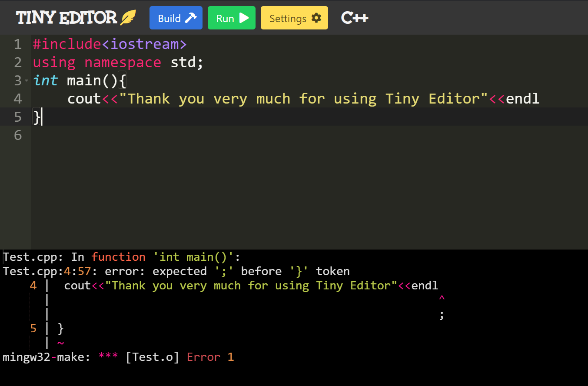

# Tiny Editor 

**Lightweight simple editor** for little task and projects.
The purpose of this project is create a desktop application for windows that works as a simple text editor, with the easy of running code in java, python, c++. It also gives the possibility of having an integrated console to show errors but execute code in external console.  
The project is oriented to be used by people who are starting in the world of programming and need a simple editor to program.

---

   

### Built with 🛠️

* [Electron](https://www.electronjs.org/)
* [Bulma](https://bulma.io/)
* [Ace editor](https://ace.c9.io/)
  
---

### 📃 Notes

This is a first simple version, now i'am working in:
* Create tutorials to install and configure, java and python
* Allow to configurate enviroment of the TinyEditor.
* Allow multiple files for edit and explorer (tree directory).
* Option to configure the makefiles.  

### Pre-requirements 📋

 ▶️ [Node](https://nodejs.org/es/) Need install npm too   
 ▶️ [Mingw](https://osdn.net/projects/mingw/releases/)  You can use [this](https://github.com/DavidVillalobos/Tiny_Editor/blob/master/doc/Install-MinGW/Install_MinGW.md) documentation. Then need install mingw32-make.exe from all packages you can use [this](https://github.com/DavidVillalobos/Tiny_Editor/blob/master/doc/Install_MinGW32Make/Install_MinGW32Make.md) documentation  
 ▶️ [Electron](https://nodejs.org/es/) This is installed in the dependencies  
 ▶️ [Bulma](https://bulma.io/) This is installed in the dependencies  
 
### Optional  

These are needed so that you can program in them, if for example you are not going to program in python you do not need to install it:  

▶️ [G++](https://osdn.net/projects/mingw/releases/) (Compiler of c++) You can install it from MinGW you can use [this](https://github.com/DavidVillalobos/Tiny_Editor/blob/master/doc/Install-g%2B%2B/Install_G%2B%2B.md) documentation  
▶️ [Java](https://www.oracle.com/java/technologies/javase-downloads.html)    
▶️ [Python](https://www.python.org/)    

Make sure that the programs **can be located from the system   
variables in PATH** : javac, java, g++ and python. 

---

### There are two ways to install TinyEditor, with the latest version in development or the pre-realease

---
### Installation of last version 🔧

Download code [here](https://github.com/DavidVillalobos/Tiny_Editor/archive/master.zip) and extract where you prefer  
or clone like:  
~~~cmd
git clone https://github.com/DavidVillalobos/Tiny_Editor
~~~  
  
### Install Depencendies

~~~cmd
cd Tiny_Editor/src
npm install
~~~

### Usage of last version

Once dependencies is installed, run the 
next command to start TinyEditor  

~~~cmd
npm start
~~~

Choose a language between C++, Java and Python.  
That's it, program!  

Press Build to compile code, and run to execute!

---

### Installation pre-realease ✔️

Download the first version [here](https://github.com/DavidVillalobos/Tiny_Editor/releases)

### Usage pre-realease

Start TinyEditor.exe from project folder  
Choose a language between C++, Java and Python.  
That's it, program!  
Press Build to compile code, and run to execute!

---

The project is inspired by [vscode](https://code.visualstudio.com/)

### Author 

* **[DavidVillalobos](https://github.com/DavidVillalobos)** 

### Contributing

Pull requests are welcome.   
For major changes, please open an issue first to discuss what you would like to change.  
You can contact me at 📫 : villalobosgonzalezluisdavid@gmail.com  

## License
The project is licensed by  
