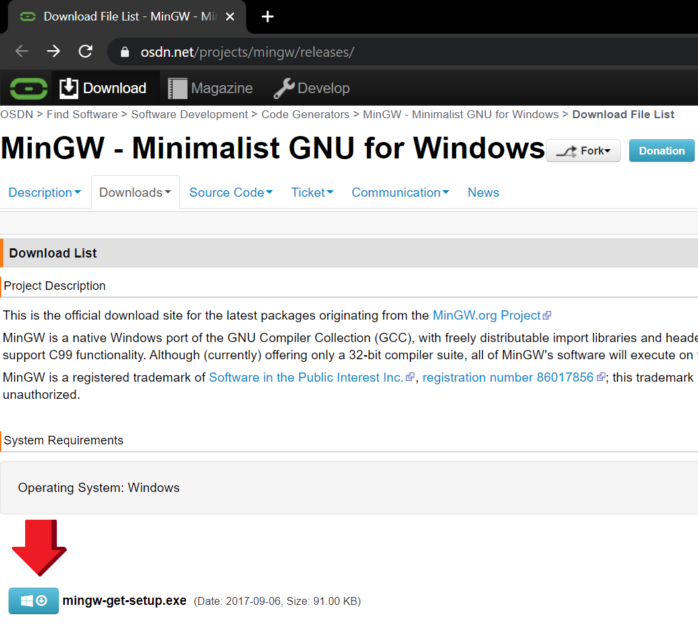
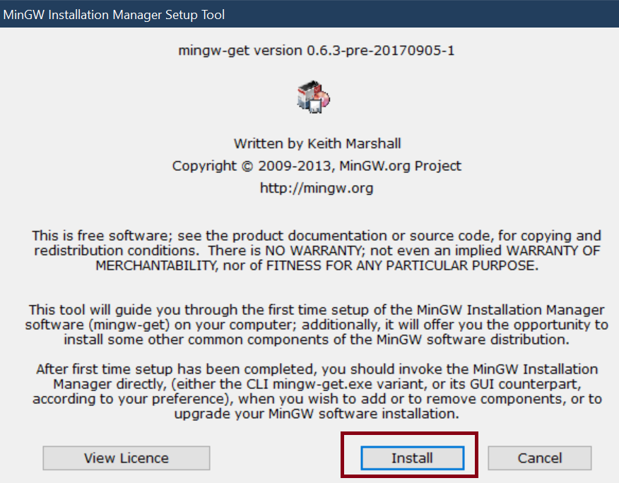
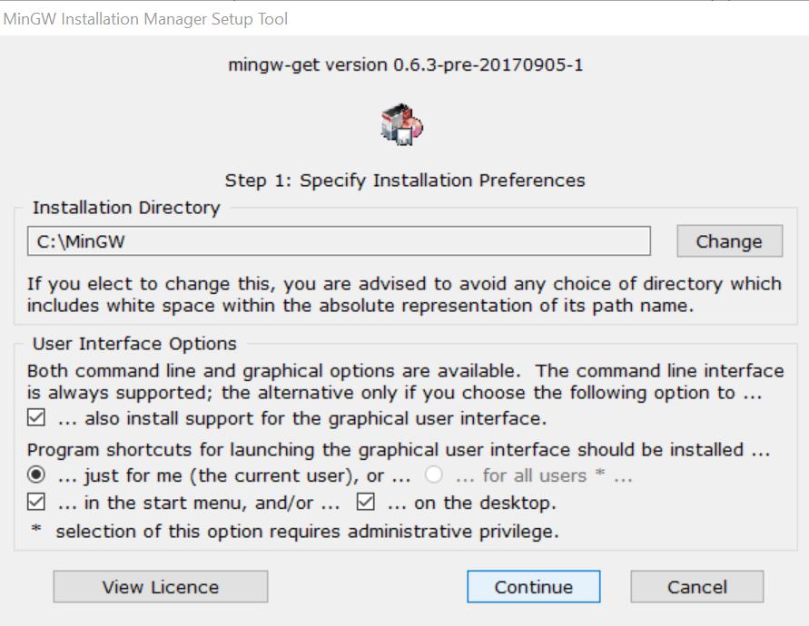
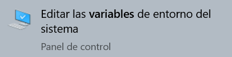
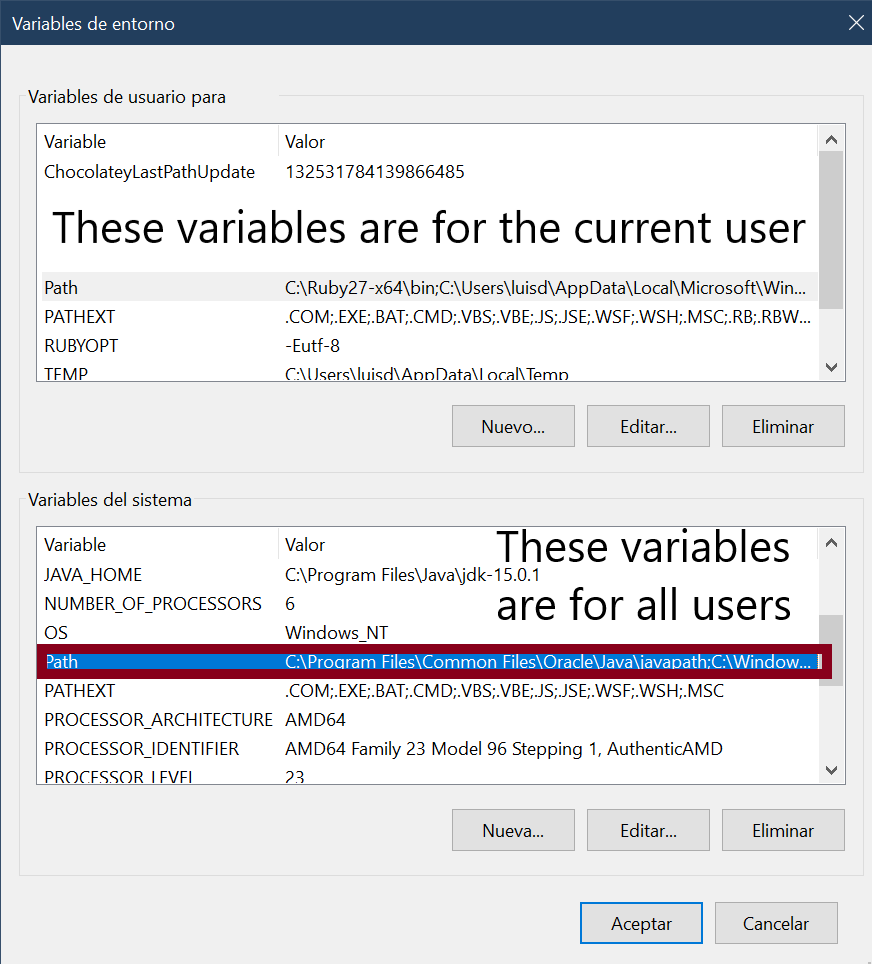
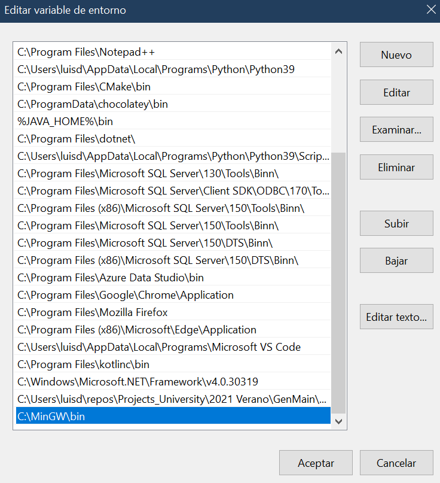

# Installation MINGW  

## MinGW is a Minimalist GNU for Windows

A native Windows port of the GNU Compiler Collection (GCC), with freely distributable import libraries and header files for building native Windows applications.   

You will need this program to be able to install g ++ to compile c ++ code and ming32-make to be able to execute the makefiles

---

## Steps

First, we need to install the Mingw available in [this](https://osdn.net/projects/mingw/releases/) site we must download mingw-get-setup.exe.   

  
Once downloaded we open the installer located in downloads and follow the general steps of any installer:     

It is very important that the program is installed in the root of the disk, do not change the location only press continue.  

    

Press continue and close the installer  

    

And that's it, you already have MinGW installed

# Settings 
## Add MinGW\bin to the PATH

The programs that can be run through the console are stored in multiple locations, the system locates them through a
path (PATH) that specifies which should be registered, these paths can be saved in variables, these are known as
environment variables, we must locate the folder bin of MinGW so that it can be used, and save its location in the PATH environment which is where the locations of the programs in general are stored in order to be executed from the console.
In addition, they can be saved depending on the current user of the computer or in general for all users of the equipment, as in this case we are going to do it.

	1. First, we look in the Windows search engine "Edit environment variables"

	2.	We select "Environment variables"
  

	3. 	We select the variable "PATH" and in "Edit" of the box below, the one above is the one for the current user, the one below is for all users

	4. 	Select in New and write the location of g ++. Exe  
				Expected location: C:\MinGW\bin    

	5. 	Select accept in each tab that was left open.  
	In this way the system will find all the programs in the registered folder C:MinGW\bin and thus we will have   
	new commands to execute from the console.  

And that's it, now all the tools you install with mingw will be recognized from the console.
