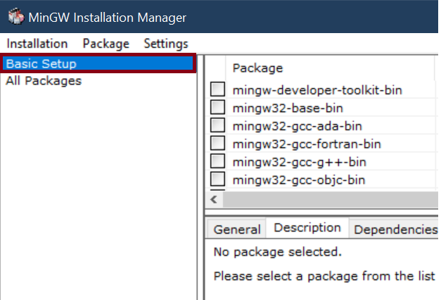
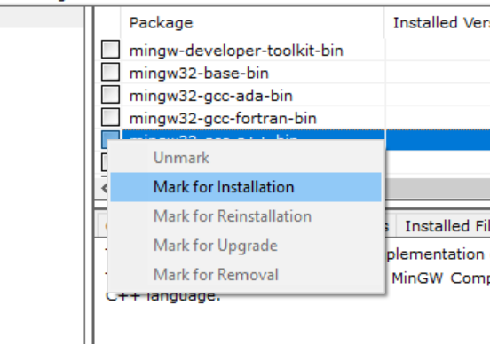
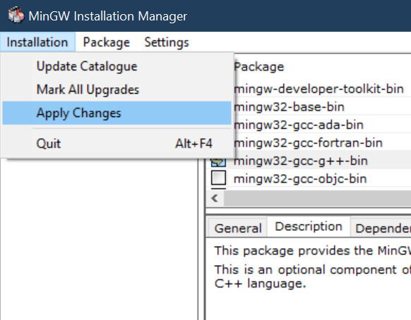

# Installation G++ 

G++ is a command line compiler that compiles and links C ++ programs, generating the corresponding executable file (.exe).  
In order to execute the G ++ compilation commands we need a console (or terminal window), which is a text mode window that  
allows to give instructions to the operating system (OS) by executing commands by one (consoles such as cmd, powershell or  
bash linux).  
The OS understands a series of default commands (dir, cd, copy, move, ...), each one with its own syntax that  
must be respected. And as we install certain programs, more commands are added that can be executed in the console.  
For example, after installing MinGW we can install and configure the g ++ command to compile C ++ programs.   

The g++ command also has its particular syntax that we must know and respect in order to write and execute the compilation 
commands correctly.  

First you must install MinGW see [this documentation ](../Install-MinGW/install_MinGW.md) for install MinGW

We start the MinGW program, it probably already starts by itself, but you can search for it in Windows as "MINGW".  
We proceed to install the C++ compiler (G++).  

	1. Select the Basic Setup category.  

	2. We mark the option of mingw32-gcc-g++-bin, selecting "Mark for Installation"

	3. Select the installation tab and apply the changes and press apply.  

	4. We apply the changes, Wait for the g++ installation to finish and close the window and MinGW mannager.