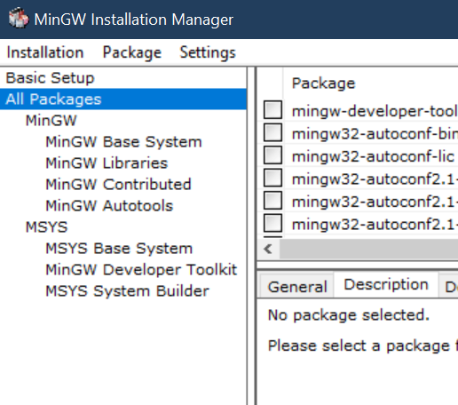
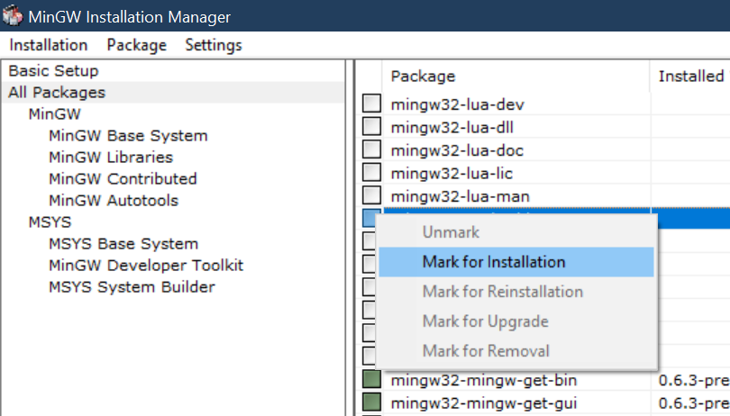
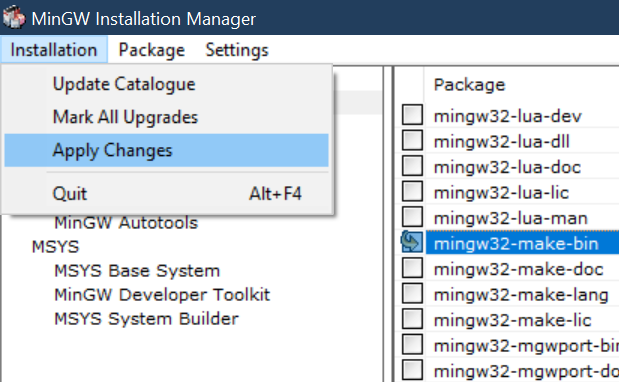
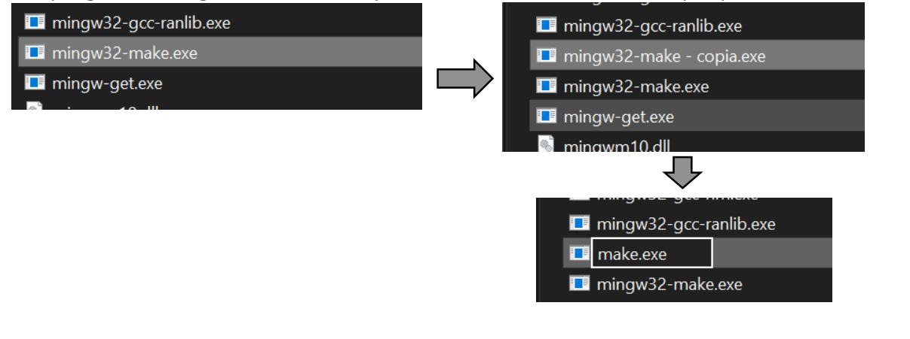

# Install mingw32-make

To compile programs in c++ it is necessary to invoke a compiler (g++) using a series of rules. It usually becomes complicated and tiring to be writing text, as a solution to this we can create a "makefile" file that is responsible for developing the necessary command to compile our program with g ++, for this we need to install mingw32-make.  

First you must install MinGW see [this documentation ](../Install-MinGW/install_MinGW.md) for install MinGW

	1.	Now we open MinGW Mannager.
  

	2.	Now we look in the tab of all packages (All Packages).
	we mark the option of mingw32-make-bin , selecting "Mark for Installation" 

	3. We apply the changes, Wait for the mingw32-make installation to finish and close the window and MinGW mannager.	 

	4. 	As a personal recommendation for ease of use, it is better to copy the mingw32-make.exe program and rename the copy to "make.exe" this way it is easier to use it from the console.
